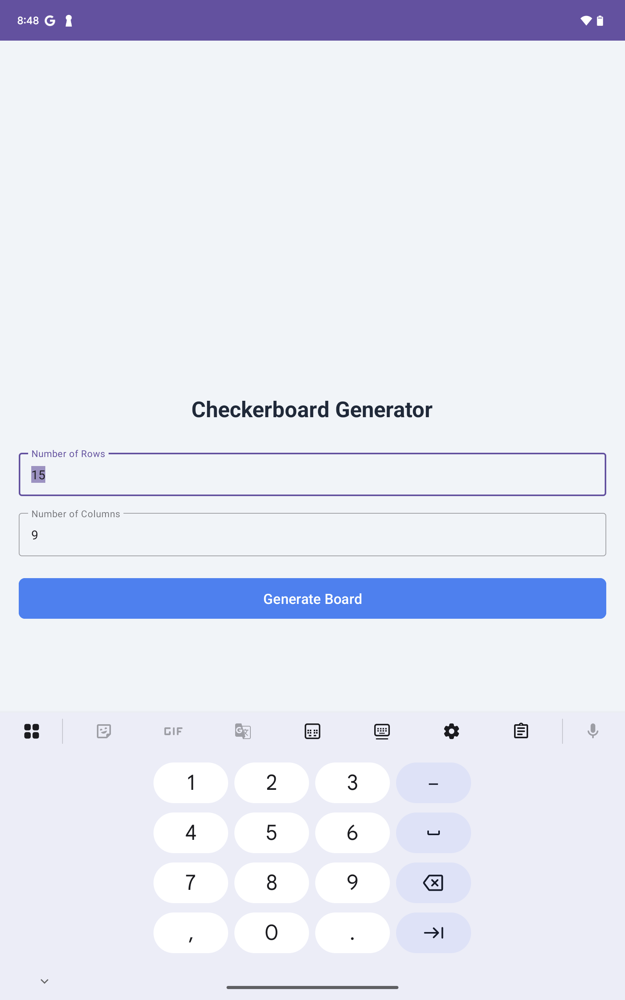
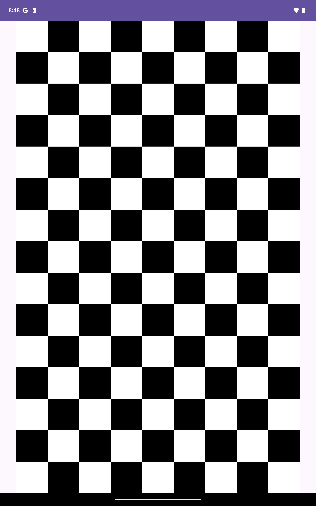
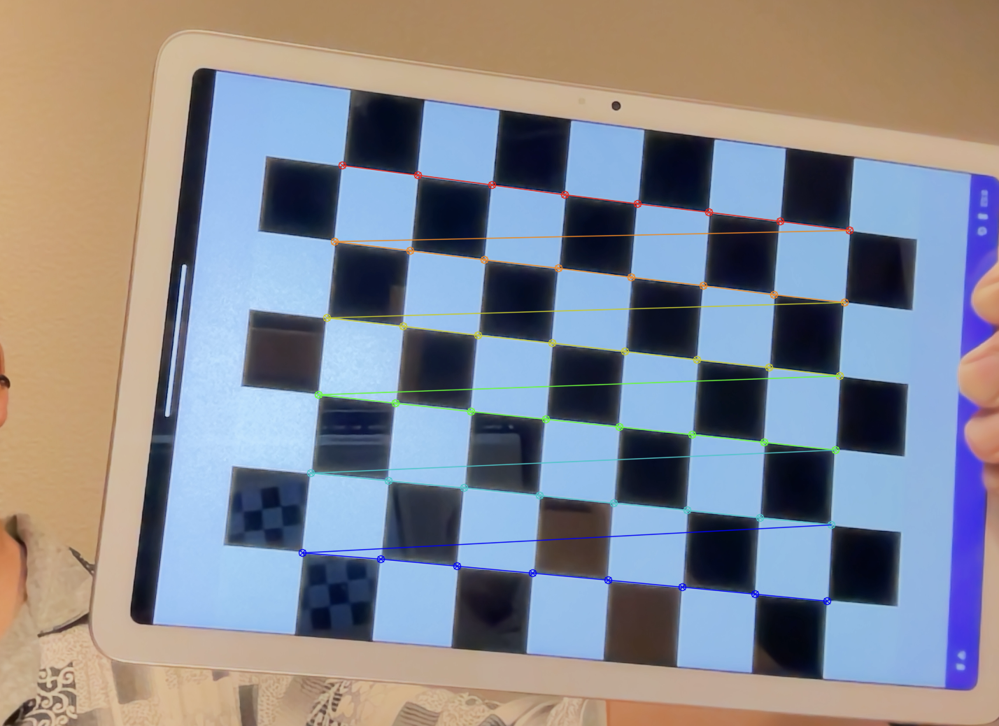

# CheckboardAnroidApp
Checkerboard is one of the mostly adapted patterns that are used for camera calibration. The checkerboard pattern are usually printed on a piece of papar and attached on a flat surface. However, there are two main challenges:
 - It is not flexible to use the printed pattern in terms of the checker size (col and row numbers).
 - The holder of the printed page may not be flat, resulting in calibration errors in the camera calibrations.

This is a simple Android Studio project written in Kotlin. In general, it takes inputs of the row and col numbers of a checkerboard, and generate and show it in the next view.  It returns to the args page if double-clicking the checkerboard pattern. The display of a tablet or a smartphone are very flat. Additionaly, the dimension of the display are precisely described in the specification sheets in most of the cases. So the screen based checkerboard pattern could provide reliable object points in camera calibration tasks.

## How the APP works
### Input the checkerboard row and col numbers

### Click the "Generate Board" pattern to show the checkerboard pattern.
Note that the pattern will use the max available pixels in the relatively "shorter" axis. Other area will be white background.

## The checkerboard in camera calibration

## How to Set Up the Project

### Create a New Project:

Open Android Studio.

Select "New Project" -> "Empty Views Activity".

Choose "Kotlin" as the language.

Give your project a name (e.g., CheckerboardApp) and a package name (e.g., com.example.checkerboardapp).

Click "Finish".

### Add Material Design Dependency (Optional but Recommended):

Open your module-level build.gradle.kts (or build.gradle) file.

Ensure the Material Components library is included in the dependencies block. It's usually there by default in new projects.

implementation("com.google.android.material:material:1.12.0")

Sync your project with the Gradle files.

### Copy the Code Files:

activity_main.xml: Replace the contents of app/src/main/res/layout/activity_main.xml with the code provided.

MainActivity.kt: Replace the contents of app/src/main/java/com/example/checkerboardapp/MainActivity.kt with the code provided. (Make sure the package name at the top matches your project's package name).

activity_checkerboard.xml: Right-click on the app/src/main/res/layout directory, select "New" -> "XML" -> "Layout XML File", name it activity_checkerboard.xml, and copy the provided code into it.

CheckerboardActivity.kt: Right-click on your package directory (app/src/main/java/com/example/checkerboardapp), select "New" -> "Kotlin Class/File", name it CheckerboardActivity, and copy the provided code into it.
