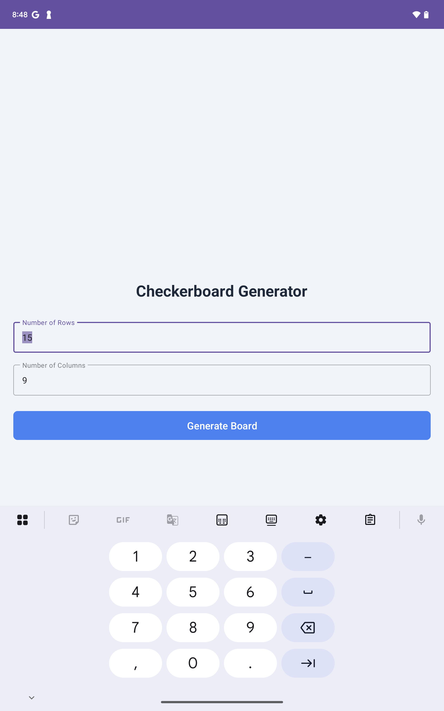
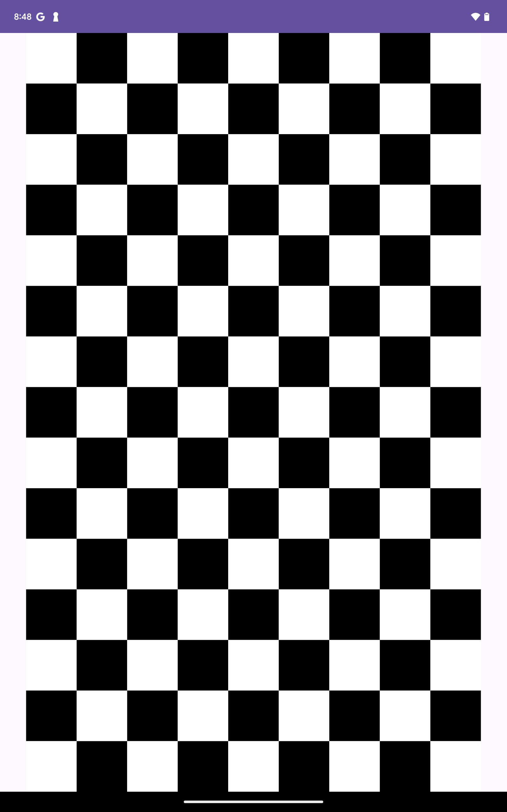
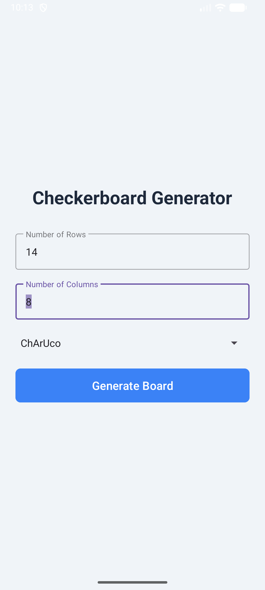
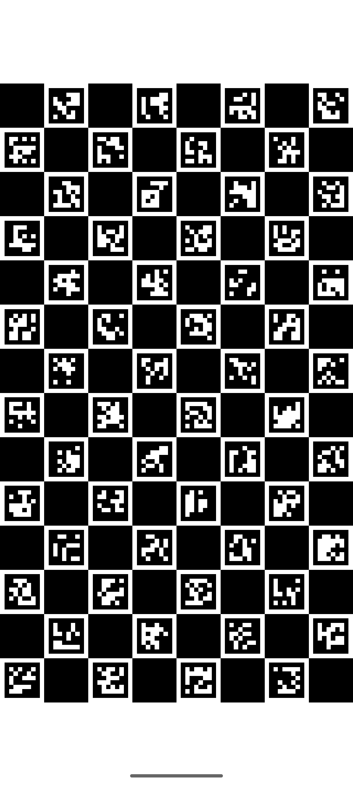
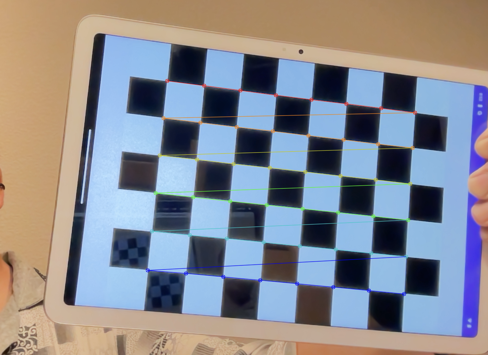
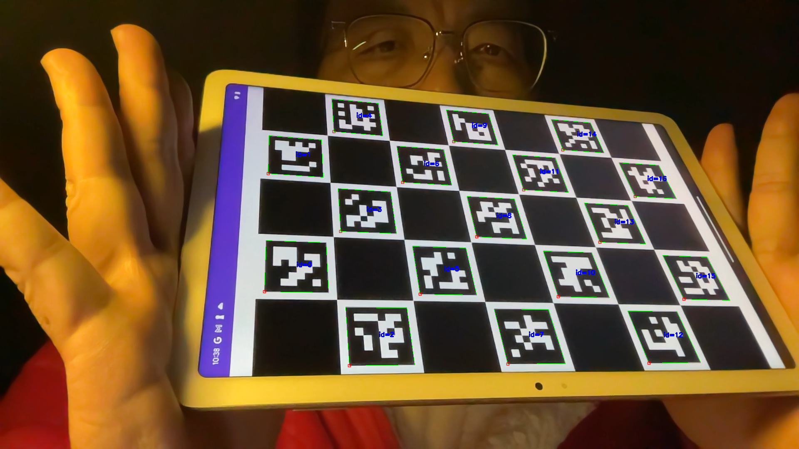

# CameraCalibrationBoardAndroidApp

An Android app (Kotlin) that displays checkerboard and ChArUco calibration patterns directly on screen — no printing required.

## Motivation

Printed calibration boards have two practical limitations:

- **Inflexible geometry** — the square size and row/column count are fixed at print time.
- **Flatness issues** — a hand-held printed page is rarely perfectly flat, introducing systematic errors into camera calibration.

A smartphone or tablet screen solves both problems. The display surface is optically flat, and the physical pixel pitch is precisely documented in the device spec sheet — giving you reliable, measurable object points without any physical board.

## Features

- Generate **checkerboard** or **ChArUco** patterns on demand
- Adjustable **row and column counts** via input fields
- Pattern automatically fills the shorter screen axis, maximizing size while keeping aspect ratio correct
- Double-tap the pattern to return to the parameter input screen
- Works on both smartphones and tablets

## Screenshots

### Input parameters


### Checkerboard pattern output


### ChArUco parameter input


### ChArUco pattern output


### In use — tablet as calibration target


### ChArUco detection with OpenCV


## Getting started

### Prerequisites

- Android Studio (Hedgehog or later)
- Kotlin support enabled (default in new projects)
- Min SDK: API 24 (Android 7.0) or higher recommended

### Installation

1. **Clone the repo**

```bash
git clone https://github.com/zebraoptics/CameraCalibrationBoardAndroidApp.git
```

2. **Open in Android Studio**

   File → Open → select the cloned folder.

3. **Sync Gradle**

   Android Studio will prompt you to sync. Accept and wait for dependencies to resolve. The Material Components library is required:

```groovy
implementation("com.google.android.material:material:1.12.0")
```

4. **Run on device or emulator**

   Connect your Android device or start an emulator, then click **Run**.

## Using the app

1. Select pattern type — **Checkerboard** or **ChArUco** — from the dropdown
2. Enter the desired **row** and **column** counts
3. Tap **Generate Board** to display the pattern full-screen
4. **Double-tap** the pattern to return to the input screen

## Using the pattern for camera calibration

The on-screen pattern can be used directly with OpenCV's calibration pipeline. The physical square size can be derived from your device's screen resolution and pixel pitch (available in the device spec sheet).

```python
import cv2
import numpy as np

# Example: checkerboard with known square size in meters
square_size = 0.0195  # meters — measure or derive from device spec sheet
pattern_size = (cols - 1, rows - 1)  # inner corners

objp = np.zeros((pattern_size[0] * pattern_size[1], 3), np.float32)
objp[:, :2] = np.mgrid[0:pattern_size[0], 0:pattern_size[1]].T.reshape(-1, 2)
objp *= square_size

# Find corners
gray = cv2.cvtColor(frame, cv2.COLOR_BGR2GRAY)
ret, corners = cv2.findChessboardCorners(gray, pattern_size, None)
```

## Related project

**[opencv_contrib_android](https://github.com/zebraoptics/opencv_contrib_android)** — Pre-built OpenCV 4.12 Android SDK with all `opencv_contrib` modules (including `aruco` and `charuco`) compiled in. Required if you want to detect ChArUco patterns in your own Android app.

## License

MIT
